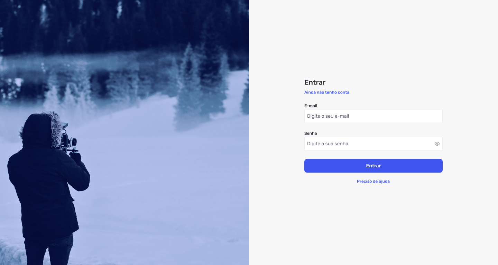

# Design-Experiments
Espaço para explorar conceitos de design e prototipagem como parte da minha rotina de aprendizado e experimentação

## Objetivo  
Meu objetivo é criar protótipos interativos, documentar processos de design e compartilhar insights enquanto construo algo significativo no campo de design de produtos digitais.  

## O que você encontrará aqui  
- Prototipagem de interfaces (UI/UX)  
- Experimentos com design responsivo  
- Ideias e esboços para projetos futuros  
- Documentação de aprendizados  

## Sobre mim  
Sou Product Designer, dedicado a aprender na prática e construir projetos significativos. Este repositório é o reflexo da minha jornada.

## Contribuições  
Sugestões são sempre bem-vindas! Fique à vontade para abrir uma issue ou enviar um pull request.  

---

**Atualizações diárias:** Este repositório será atualizado diariamente com pequenas tarefas que refletem o progresso no aprendizado e execução de projetos de design.

## Protótipos Recentes  

### Tela de Login  

## Design System  
Visualize o design system [aqui](https://aloydesigner.github.io/design-experiments)
